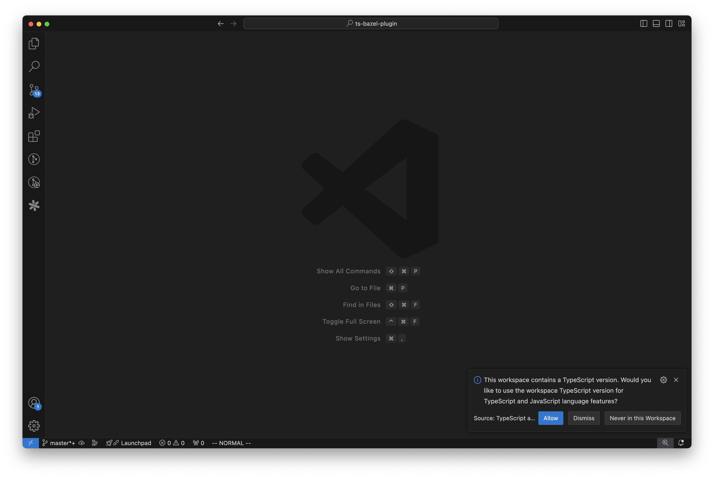

# `ts-bazel-plugin`

A TypeScript [language service plugin](https://github.com/microsoft/TypeScript/wiki/Writing-a-Language-Service-Plugin) for working with [Bazel](https://bazel.build/) frontend monorepos.

## Background

Bazel insists on separating build output from the source tree. There are a lot of advantages to this, but it makes integration with the IDE difficult by breaking things like [declaration maps](https://www.typescriptlang.org/tsconfig/#declarationMap). This plugin tries to smooth out some of the rough edges.

## Setup

### Bazel

This plugin works best with [aspect-build/rules_js](https://github.com/aspect-build/rules_js) `2.x.x` and [`js_library()`](https://github.com/aspect-build/rules_js/blob/main/docs/js_library.md) instead of [`npm_package()`](https://github.com/aspect-build/rules_js/blob/main/docs/npm_package.md).

In each package, add a `node_modules` symlink which points to the corresponding `node_modules` directory in `bazel-bin`.

### `package.json`

Add the following NPM dependencies to your monorepo's root `package.json`:

-   `ts-bazel-plugin`
-   `typescript`

### `tsconfig.json`

```json5
{
    compilerOptions: {
        // Register the plugin
        plugins: [{ name: "ts-bazel-plugin" }],

        // Configure TypeScript to emit `.d.ts` and `.d.ts.map` files
        declaration: true,
        declarationMap: true,
    },
}
```

### `.vscode/settings.json`

Configure VSCode to use the workspace's version of TypeScript. For security reasons, TypeScript resolves plugins relative to `tsserver.js` instead `tsconfig.json`. Without this TypeScript won't be able to find our plugin. See [microsoft/TypeScript#42688](https://github.com/microsoft/TypeScript/issues/42688) for more details.

```json5
{
    "typescript.tsdk": "node_modules/typescript/lib",
    "typescript.enablePromptUseWorkspaceTsdk": true,
}
```


